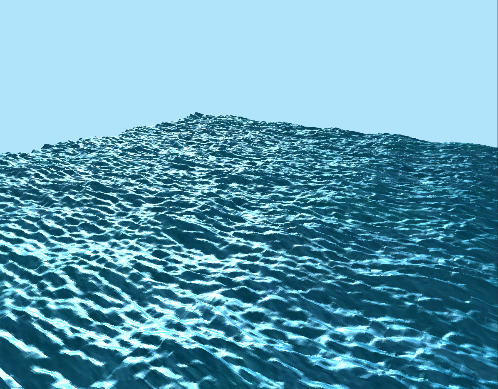
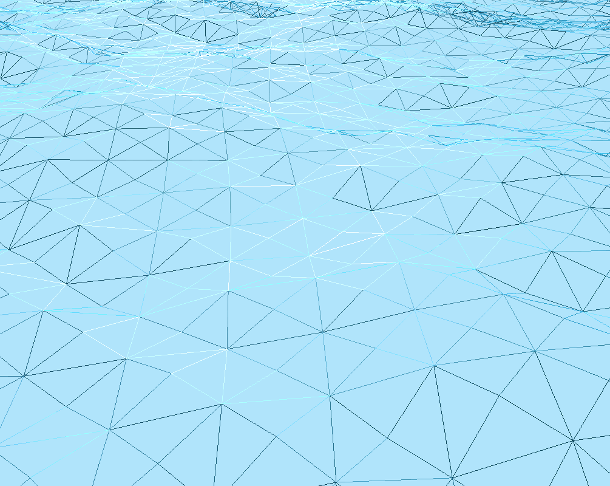

# Tessellated water effect

In this project, I played around with shaders and used tessellation and a geometry shader (With a superposition of Gerster waves)
to simulate some water. Some of the key features of it are:

- Variable Tessellation
- Gerstner wave simulation in geometry shader
- Phong lighting
- Displacement maps

This project was compiled with the additional includes/libraries:
- GLEW
- GLFW
- GLM

If you plan to compile it, then make sure you specify those additional include/libraries in your IDE/Makefile.
Otherwise, I've provided a bin folder with the executable in it :)

## Controls
- <code>UP</code>: Move camera forwards
- <code>DOWN</code>: Move camera backwards
- <code>RIGHT</code>: Increase tessellation
- <code>LEFT</code>: Decrease tessellation
- <code>SPACE</code>: Wireframe mode
